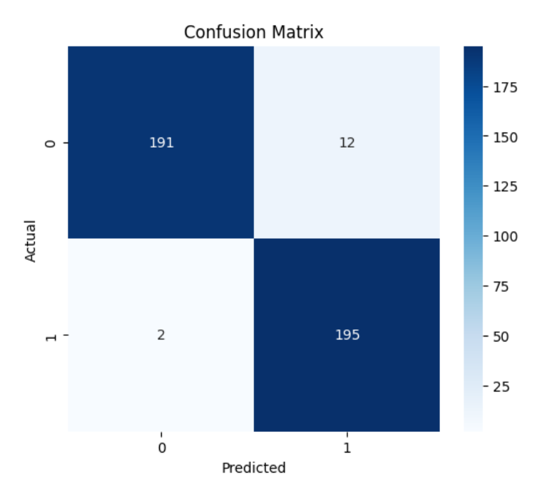
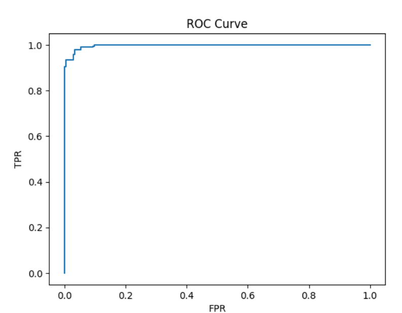
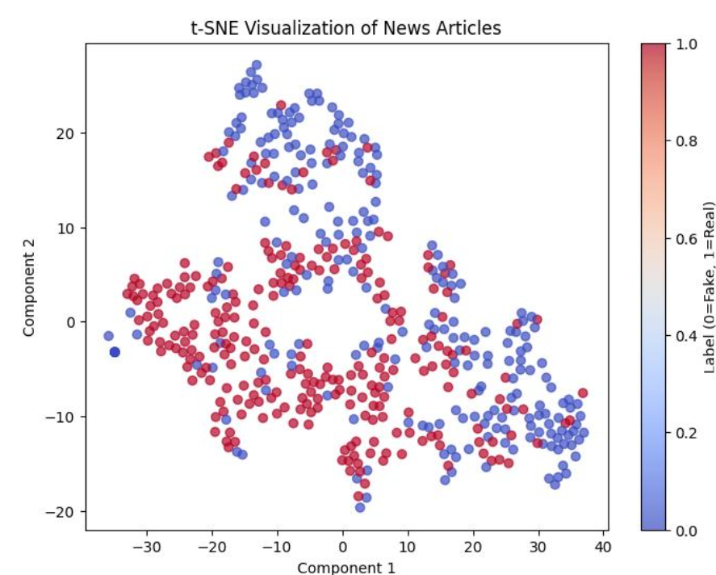
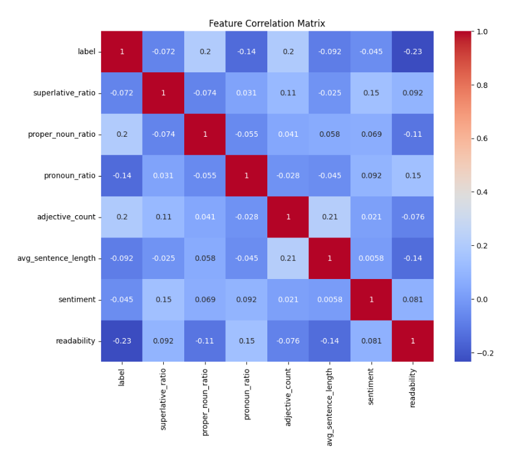
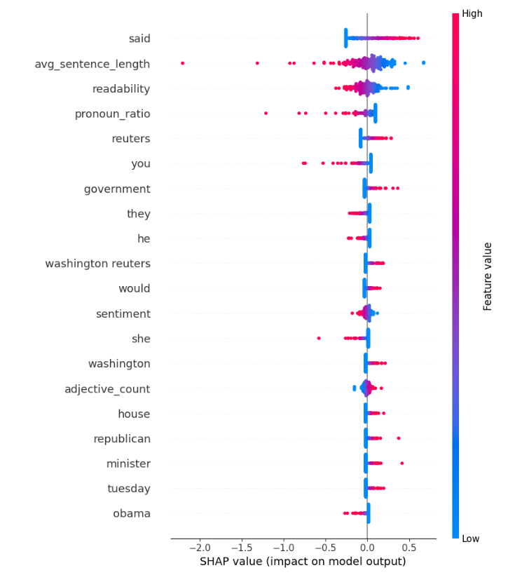
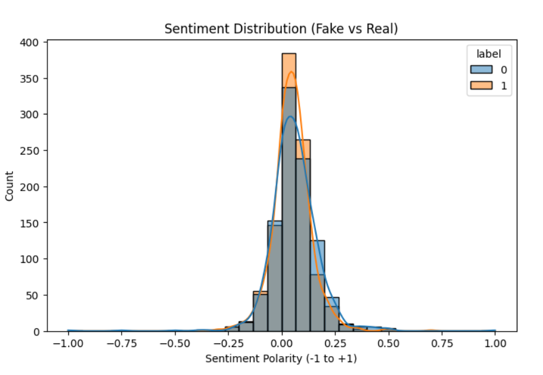
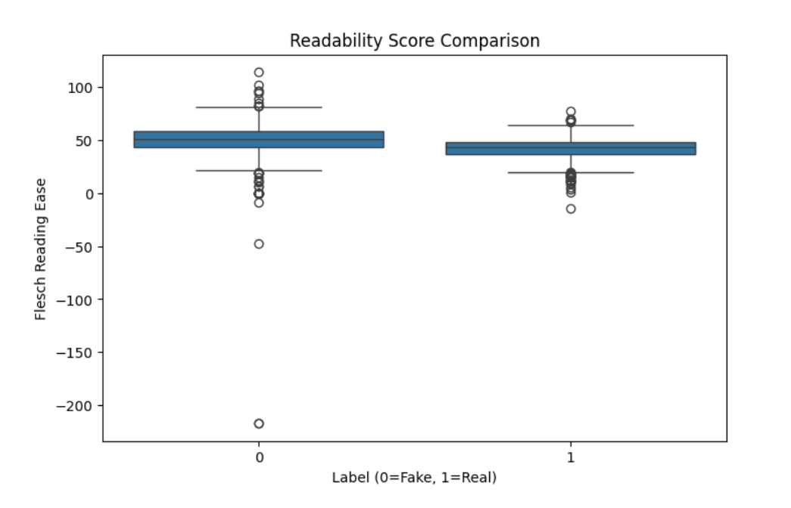

<div align="center">

# 📰 TruthLens AI

### Intelligent Fake News Detection using Natural Language Processing & Machine Learning

*Detecting misinformation through hybrid linguistic intelligence, explainable AI, and advanced feature engineering.*

<br>


</div>

---

## 📖 Overview

**TruthLens AI** is an intelligent Natural Language Processing (NLP) system designed to automatically distinguish between **real** and **fake news articles** using a hybrid machine learning pipeline.

Unlike conventional fake news classifiers that rely solely on textual representations such as **TF-IDF**, TruthLens AI combines **semantic**, **linguistic**, **structural**, and **psychological** features to capture deeper writing patterns commonly observed in misinformation.

The system integrates advanced feature engineering techniques including **Part-of-Speech analysis**, **syntactic complexity**, **readability metrics**, **sentiment analysis**, and **TF-IDF vectorization**, producing a rich feature representation for robust classification.

To improve transparency and interpretability, the project also incorporates **SHAP (SHapley Additive Explanations)** for explainable AI, allowing users to understand how individual features influence model predictions.

Beyond classification, TruthLens AI provides comprehensive analytical visualizations including **Confusion Matrices**, **ROC Curves**, **Correlation Heatmaps**, **t-SNE feature projections**, **Sentiment Distributions**, and **Readability Analysis**, transforming the project into a complete NLP research platform rather than a simple machine learning classifier.

---

## ✨ Key Features

- 📰 Binary Fake vs Real News Classification
- 🧠 Hybrid Feature Engineering Pipeline
- 🔤 TF-IDF with Unigram & Bigram Representation
- 🏷️ Part-of-Speech (POS) Feature Extraction
- 🌳 Structural & Syntactic Language Analysis
- 😊 Sentiment Polarity Analysis using TextBlob
- 📚 Readability Scoring using Flesch Reading Ease
- 📊 Correlation Heatmaps & Statistical Analysis
- 📈 ROC Curve & Confusion Matrix Visualization
- 🌐 t-SNE Dimensionality Reduction
- 🔍 SHAP Explainable AI for Model Interpretability
- 📉 Detailed Error Analysis of Misclassified Samples
- ⚡ Logistic Regression Classification Pipeline
- 📑 Comprehensive Performance Evaluation

---

# 📸 Screenshots

<p align="center">

<b>TruthLens AI Classification Pipeline</b>

<br><br>




<br><br>




<br><br>




</p>

---

# 📑 Table of Contents

- Overview
- Key Features
- Project Architecture
- NLP Pipeline
- Dataset
- Feature Engineering
- Machine Learning Model
- Experimental Results
- Visualizations
- Technology Stack
- Installation
- Usage
- Future Improvements
- Skills Demonstrated
- Author
- License

---

---

# 🎯 Problem Statement

The rapid growth of digital media has dramatically increased the accessibility of information. While this has enabled faster communication across the globe, it has also accelerated the spread of misinformation and fabricated news.

Fake news articles often imitate the writing style of legitimate journalism, making manual verification difficult and time-consuming. Their widespread circulation can influence public opinion, manipulate elections, create social unrest, and undermine trust in reliable news sources.

Traditional fake news detection systems primarily rely on keyword matching or shallow textual representations. While effective in some cases, these approaches often struggle to capture deeper linguistic patterns, contextual relationships, and stylistic cues that distinguish genuine journalism from fabricated content.

TruthLens AI addresses this challenge by combining classical Natural Language Processing with modern Machine Learning and Explainable AI techniques to build a robust, interpretable, and scalable misinformation detection system.

---

# 💡 Motivation

The inspiration behind TruthLens AI stems from the growing societal impact of misinformation in today's digital landscape.

With millions of news articles published daily across online platforms, manually verifying authenticity has become increasingly impractical.

Instead of simply predicting whether an article is fake or real, TruthLens AI aims to answer two fundamental questions:

> **Is this article trustworthy?**

and

> **Why did the model make this prediction?**

By integrating Explainable AI alongside hybrid linguistic feature engineering, the project seeks to bridge the gap between high predictive accuracy and model transparency.

---

# 🏗 System Architecture

TruthLens AI follows a modular machine learning architecture where every stage performs a specific responsibility before passing its output to the next processing stage.

```text
                        News Dataset

                             │

                             ▼

                  Data Cleaning & Preprocessing

                             │

         ┌───────────────────┼───────────────────┐

         ▼                   ▼                   ▼

   Text Cleaning        Tokenization       Lemmatization

                             │

                             ▼

                  Feature Engineering Layer

        ┌────────────┬─────────────┬────────────┐

        ▼            ▼             ▼

     TF-IDF      POS Features   Readability

        │            │             │

        └────────────┼─────────────┘

                     ▼

           Combined Feature Vector

                     │

                     ▼

            Machine Learning Model

                     │

                     ▼

              Prediction Engine

                     │

       ┌─────────────┼──────────────┐

       ▼             ▼              ▼

 Prediction     Performance     Explainability

                   │

                   ▼

        Confusion Matrix • ROC Curve

         t-SNE • SHAP • Heatmaps
```

---

# ⚙ Project Workflow

TruthLens AI processes every news article through a carefully designed Natural Language Processing pipeline.

```text
News Article

      │

      ▼

Text Cleaning

      │

      ▼

Tokenization

      │

      ▼

Stopword Removal

      │

      ▼

Lemmatization

      │

      ▼

Feature Engineering

      │

      ▼

TF-IDF Vectorization

      │

      ▼

POS Extraction

      │

      ▼

Readability Metrics

      │

      ▼

Sentiment Analysis

      │

      ▼

Feature Fusion

      │

      ▼

Machine Learning Model

      │

      ▼

Prediction

      │

      ▼

Model Evaluation

      │

      ▼

Explainability
```

---

# 📂 Project Structure

```text
TruthLens-AI

│

├── dataset
│   ├── Fake.csv
│   └── True.csv
│
├── fake_news_classifier.ipynb
│
├── Screenshots
│   ├── pipeline.png
│   ├── confusion_matrix.png
│   ├── roc_curve.png
│   ├── tsne.png
│   ├── shap.png
│   ├── sentiment.png
│   └── heatmap.png
│
├── requirements.txt
│
├── README.md
│
└── NLP Report.pdf
```

---

# 🗄 Dataset

TruthLens AI is trained and evaluated using the **ISOT Fake News Dataset**, one of the most widely used benchmark datasets for misinformation detection research.

The dataset contains two independently curated collections of news articles:

| Dataset | Description |
|----------|-------------|
| **True.csv** | Authentic news articles collected from verified news agencies |
| **Fake.csv** | Fabricated news articles collected from websites known for publishing misinformation |

Each article includes

- Title
- Article Content
- Subject Category
- Publication Date

The balanced nature of the dataset allows the model to learn meaningful distinctions between authentic journalism and fabricated reporting.

---

# 🧹 Data Preprocessing

Before training, every article undergoes an extensive preprocessing pipeline.

Processing stages include:

- Lowercase normalization
- Removal of punctuation
- Removal of special characters
- Removal of numerical noise
- URL removal
- HTML artifact removal
- Tokenization
- Stopword filtering
- Lemmatization

These steps reduce noise while preserving the linguistic information necessary for feature extraction.

---

# 🧠 Feature Engineering

Rather than relying on a single representation of text, TruthLens AI combines multiple complementary feature types into one unified feature vector.

## TF-IDF Features

Captures the statistical importance of words within each document.

Used features include:

- Unigrams
- Bigrams
- Word Frequency
- Document Frequency

---

## Linguistic Features

Extracted using Natural Language Processing techniques.

Examples include:

- Proper Noun Ratio
- Pronoun Ratio
- Superlative Ratio
- Average Sentence Length
- Word Count

---

## Sentiment Features

Measures the emotional polarity expressed within an article.

Calculated metrics include:

- Positive Sentiment
- Negative Sentiment
- Neutrality
- Overall Polarity

---

## Readability Features

Measures how easy the article is to understand.

Metrics include:

- Flesch Reading Ease
- Average Word Length
- Sentence Complexity

---

# 🎯 Why Hybrid Features?

Most beginner fake news classifiers rely exclusively on TF-IDF vectors.

TruthLens AI instead combines

- Statistical Features
- Linguistic Features
- Structural Features
- Sentiment Features
- Readability Metrics

to create a significantly richer representation of each news article.

This hybrid approach enables the model to capture both **what is written** and **how it is written**, improving robustness and interpretability.

---

---

# 🤖 Machine Learning Pipeline

TruthLens AI employs a supervised machine learning pipeline that transforms raw news articles into high-dimensional feature representations before performing binary classification.

The workflow emphasizes both **predictive performance** and **model interpretability**, ensuring that every prediction can be understood rather than treated as a black box.

```text
Preprocessed Articles

        │

        ▼

Feature Engineering

        │

        ▼

TF-IDF Vectorization

        │

        ▼

Feature Fusion

        │

        ▼

Train/Test Split

        │

        ▼

Logistic Regression

        │

        ▼

Prediction

        │

        ▼

Evaluation

        │

        ▼

Explainability (SHAP)
```

---

# 🎯 Classification Model

TruthLens AI uses **Logistic Regression** as its primary classification algorithm.

Despite its simplicity, Logistic Regression remains one of the strongest baselines for high-dimensional sparse text classification due to its:

- High computational efficiency
- Strong generalization ability
- Low training time
- Excellent interpretability
- Robust performance on TF-IDF feature spaces

The model is trained using the hybrid feature representation generated during preprocessing, allowing it to leverage statistical, structural, and linguistic characteristics simultaneously.

---

# 📊 Model Evaluation

The classifier is evaluated using multiple complementary performance metrics to ensure balanced assessment.

Metrics include

- Accuracy
- Precision
- Recall
- F1-Score
- ROC-AUC Score
- Confusion Matrix

Using multiple evaluation metrics prevents misleading conclusions that may arise from relying solely on classification accuracy.

---

# 📈 Confusion Matrix

The confusion matrix provides a detailed summary of the model's prediction performance.

<p align="center">


</p>

The matrix illustrates

- Correctly classified real news
- Correctly classified fake news
- False Positives
- False Negatives

This visualization makes it easy to identify which class presents greater classification difficulty.

---

# 📉 ROC Curve

Receiver Operating Characteristic (ROC) analysis evaluates the classifier across multiple decision thresholds.

<p align="center">


</p>

The ROC curve highlights the trade-off between

- True Positive Rate
- False Positive Rate

A higher Area Under the Curve (AUC) indicates stronger discriminatory capability.

---

# 🌐 Feature Space Visualization

High-dimensional TF-IDF vectors are difficult to interpret directly.

TruthLens AI applies **t-Distributed Stochastic Neighbor Embedding (t-SNE)** to project feature vectors into two dimensions while preserving local neighborhood relationships.

<p align="center">


</p>

The visualization demonstrates how fake and real news articles occupy distinct regions within the transformed feature space.

---

# 🔥 Correlation Analysis

Feature correlation analysis helps identify relationships among engineered linguistic features.

<p align="center">


</p>

Correlation heatmaps reveal

- Redundant features
- Independent predictors
- Strongly related linguistic characteristics

This analysis assists both feature selection and model interpretation.

---

# 🔍 Explainable AI (SHAP)

One of TruthLens AI's defining characteristics is its focus on explainability.

Instead of functioning as a black-box classifier, the project integrates **SHAP (SHapley Additive Explanations)** to explain individual predictions.

<p align="center">


</p>

SHAP provides

- Feature importance rankings
- Local prediction explanations
- Global model interpretation
- Individual contribution analysis

This enables users to understand **why** the model predicted an article as fake or real.

---

# 😊 Sentiment Analysis

TruthLens AI incorporates sentiment polarity as one component of its hybrid feature engineering pipeline.

<p align="center">


</p>

Sentiment analysis measures

- Positive polarity
- Negative polarity
- Neutrality
- Overall emotional tone

Although sentiment alone cannot determine misinformation, it contributes useful contextual information when combined with linguistic and structural features.

---

# 📏 Readability Analysis

The project evaluates the readability of news articles using established readability metrics.

<p align="center">



</p>

These features help capture stylistic differences between authentic journalism and fabricated content.

Examples include

- Flesch Reading Ease
- Average Sentence Length
- Average Word Length
- Lexical Complexity

---

# ❌ Error Analysis

Understanding model failures is just as important as measuring its successes.

TruthLens AI performs qualitative error analysis by examining misclassified articles to identify recurring patterns such as

- Ambiguous wording
- Highly objective fake news
- Opinionated real news
- Mixed factual content

This analysis provides valuable insight into future improvements and helps guide additional feature engineering.

---

# ⚡ Performance Highlights

TruthLens AI demonstrates strong performance while maintaining excellent interpretability.

Highlights include

- High classification accuracy
- Balanced precision and recall
- Robust generalization
- Efficient inference
- Explainable predictions
- Rich hybrid feature representation

The combination of engineered linguistic features and TF-IDF vectorization enables the classifier to distinguish subtle stylistic differences that would be difficult to capture using statistical features alone.

---

# 💻 Technology Stack

| Category | Technology |
|-----------|------------|
| Programming Language | Python |
| Notebook Environment | Jupyter Notebook |
| Machine Learning | Scikit-learn |
| NLP | NLTK, spaCy |
| Feature Engineering | TF-IDF |
| Sentiment Analysis | TextBlob |
| Explainability | SHAP |
| Data Processing | Pandas, NumPy |
| Visualization | Matplotlib, Seaborn |
| Dimensionality Reduction | t-SNE |

---

# 📊 Project Statistics

| Category | Value |
|-----------|-------|
| Language | Python |
| Framework | Scikit-learn |
| NLP Libraries | NLTK, spaCy |
| Explainability | SHAP |
| Dataset | ISOT Fake News Dataset |
| Classification | Binary |
| Features | Hybrid Engineered Features |
| Output | Fake / Real |
| Visualizations | 8+ |
| Development Environment | Jupyter Notebook |

---

# 🚀 Installation

Clone the repository

```bash
git clone https://github.com/devkailu/TruthLens-AI.git

cd TruthLens-AI
```

Install dependencies

```bash
pip install -r requirements.txt
```

Launch Jupyter Notebook

```bash
jupyter notebook
```

Open

```text
fake_news_classifier.ipynb
```

Run the notebook sequentially to reproduce the complete preprocessing, feature engineering, model training, evaluation, and visualization pipeline.

---

# 📁 Repository Structure

```text
TruthLens-AI

│

├── dataset
│   ├── Fake.csv
│   └── True.csv
│
├── fake_news_classifier.ipynb
├── 23BLC1008 NLP Report.pdf
├── Screenshots
├── README.md
└── requirements.txt
```

---

---

# 🌍 Real-World Applications

The techniques implemented in TruthLens AI extend far beyond academic experimentation and have practical applications across journalism, cybersecurity, social media, and information verification.

Potential use cases include:

### 📰 News Verification Platforms

Assist journalists and editors by automatically flagging potentially misleading or fabricated articles before publication.

---

### 🌐 Social Media Moderation

Analyze shared content to identify misinformation and reduce the spread of fake news across digital platforms.

---

### 🏛 Government & Public Institutions

Support fact-checking initiatives and misinformation monitoring during elections, public health campaigns, and emergency situations.

---

### 🔍 Browser Extensions

Integrate with browsers to provide real-time credibility assessments while users read online news articles.

---

### 📚 Educational Platforms

Help students understand the linguistic differences between factual journalism and fabricated news through interactive explanations.

---

### 🤖 AI Research

Serve as a foundation for experimenting with explainable NLP models, transformer architectures, and misinformation detection research.

---

# 💼 Skills Demonstrated

TruthLens AI showcases practical experience across multiple domains of Artificial Intelligence and Software Engineering.

## 🧠 Artificial Intelligence

- Supervised Machine Learning
- Binary Text Classification
- Explainable AI (XAI)
- Model Evaluation
- Performance Optimization

---

## 📖 Natural Language Processing

- Text Cleaning
- Tokenization
- Lemmatization
- Stopword Removal
- TF-IDF Vectorization
- Part-of-Speech Analysis
- Sentiment Analysis
- Readability Analysis

---

## 📊 Data Science

- Exploratory Data Analysis
- Statistical Feature Engineering
- Dimensionality Reduction
- Data Visualization
- Correlation Analysis

---

## 💻 Software Engineering

- Modular Pipeline Design
- Reproducible Research
- Documentation
- Scientific Computing
- Version Control

---

# 🎓 Learning Outcomes

Developing TruthLens AI provided hands-on experience with

- End-to-End NLP Pipelines
- Hybrid Feature Engineering
- Explainable Machine Learning
- Text Mining
- Scientific Visualization
- Model Interpretability
- Data Preprocessing
- Performance Evaluation
- Research-Oriented Development

This project strengthened both theoretical understanding and practical implementation of Natural Language Processing techniques while emphasizing the importance of transparency in AI systems.

---

# 🔮 Future Roadmap

TruthLens AI has been designed as a modular platform that can evolve with advances in Natural Language Processing and Artificial Intelligence.

## 🤖 Transformer Models

Future versions may incorporate state-of-the-art transformer architectures such as

- BERT
- RoBERTa
- DistilBERT
- DeBERTa
- ELECTRA

to improve contextual understanding and classification accuracy.

---

## 🌐 Large Language Models

Potential integration with modern LLMs to enable

- Context-aware fact verification
- Article summarization
- Misinformation explanation
- Evidence generation
- Retrieval-Augmented Verification (RAG)

---

## 📈 Enhanced Explainability

Future explainability features include

- Interactive SHAP dashboards
- LIME explanations
- Counterfactual explanations
- Attention visualization
- Feature importance comparisons

---

## 📰 Live News Detection

Extend the pipeline to process

- RSS feeds
- Online news websites
- Social media posts
- Real-time news streams

for continuous misinformation monitoring.

---

## ☁ Deployment

Future deployment targets include

- Flask API
- FastAPI
- Streamlit Dashboard
- Docker Containers
- Cloud Deployment (AWS / Azure / GCP)

allowing TruthLens AI to function as a scalable web service.

---

# 🤝 Contributing

Contributions are welcome.

Areas for improvement include

- Additional NLP models
- Improved feature engineering
- Transformer integration
- Explainability enhancements
- User interface development
- Model optimization
- Performance benchmarking

If you'd like to contribute, feel free to fork the repository and submit a pull request.

---

# 👨‍💻 Author

<div align="center">

## Kailash Shankar R

**Computer Science Engineering Student**

Passionate about

**Artificial Intelligence • Natural Language Processing • Machine Learning • Software Engineering • Explainable AI**

---

### GitHub

https://github.com/devkailu

### LinkedIn

https://linkedin.com/in/YOUR_LINKEDIN

### Email

YOUR_EMAIL

</div>

---

# 🙏 Acknowledgements

This project would not have been possible without the incredible open-source ecosystem.

Special thanks to

- Scikit-learn
- NLTK
- spaCy
- SHAP
- TextBlob
- Pandas
- NumPy
- Matplotlib
- Seaborn
- The ISOT Fake News Dataset creators

for providing the tools and datasets that enabled this research.

---

# 📚 References

- ISOT Fake News Dataset
- Scikit-learn Documentation
- SHAP Documentation
- NLTK Documentation
- spaCy Documentation
- TextBlob Documentation

---

# 📜 License

This project was developed for educational, research, and portfolio purposes.

The source code is intended for learning, experimentation, and academic reference.

---

<div align="center">

# ⭐ If you found TruthLens AI useful, consider starring the repository!

Your support helps improve the project and encourages continued research in trustworthy AI.

---

# 📰 TruthLens AI

### Intelligent Fake News Detection using Natural Language Processing & Machine Learning

Built with ❤️ using

**Python • Scikit-learn • NLTK • spaCy • SHAP • Jupyter**

---

*"Seeing Beyond the Headlines Through Explainable Artificial Intelligence."*

</div>
